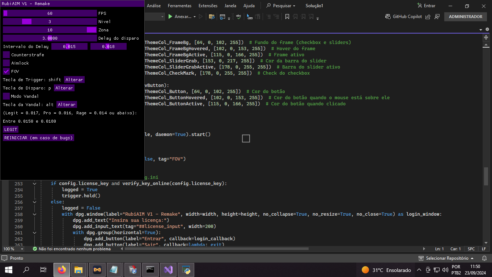
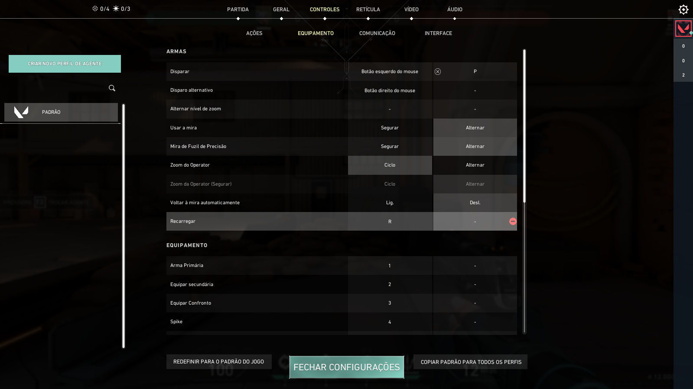

## VALORANT CHEAT

Este script conta com Aimlock para travar a mira automaticamente sobre os inimigos, além de um modo exclusivo para a arma Vandal. Nesta versão, você pode configurar a tecla de disparo para ser a tecla `'P'`, como nas versões anteriores do RubiAim, ou qualquer outra tecla de sua preferência.

## Como utilizar

1. **Baixe e execute o script** diretamente do repositório.
2. **Utilize a key de ativação**: `WelldoneFree` para desbloquear todas as funcionalidades.
3. **Configurações de Aimlock**:
   - O Aimlock garante que sua mira fique travada no inimigo durante o jogo.
   - **Modo Vandal exclusivo**: Ative este modo para otimizar a precisão ao usar a Vandal.
4. **Configuração da tecla de disparo**:
   - Nesta versão, a tecla de disparo pode ser configurada para **qualquer tecla de sua preferência**.
   - Por padrão, a tecla de disparo está configurada como `'P'`, como nas versões anteriores do RubiAim.
   - **Como alterar a tecla**: No menu de configurações do script, você pode modificar a tecla de disparo para qualquer tecla desejada.

## Como configurar:

- Certifique-se de ajustar o contorno do inimigo para **roxo** e configurar seu jogo para o **modo janela sem bordas**.

1. Acesse as **configurações do jogo** e procure por opções como **"Teclado"** ou **"Atalhos de teclado"**.
2. **Localize a função "Disparar/Atirar"**:
   - A tecla principal padrão é o **botão esquerdo do mouse**.
   - A **tecla secundária** não está atribuída por padrão. Vincule-a à tecla **'P'**:
     - No campo secundário, pressione a tecla **'P'** para vinculá-la ao disparo.
3. Agora, a tecla **'P'** será utilizada para disparar, além do botão esquerdo do mouse.

### Exibição da tecla 'P' dentro do jogo:

Dentro do jogo, a tecla `'P'` aparecerá vinculada na seção de **Atalhos de Teclado**, ao lado do botão esquerdo do mouse para a função de **disparar/atirar**. Essa tecla será ativada para o disparo quando utilizada em conjunto com o script RubiAim, garantindo precisão extra no Aimlock.

